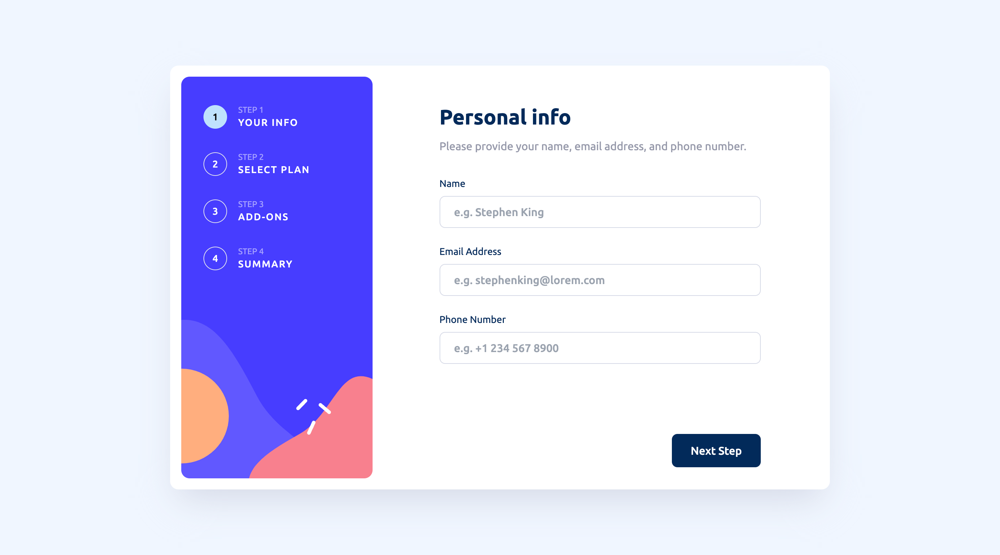

# Frontend Mentor - Multi-step form solution

This is a solution to the [Multi-step form challenge on Frontend Mentor](https://www.frontendmentor.io/challenges/multistep-form-YVAnSdqQBJ). Frontend Mentor challenges help you improve your coding skills by building realistic projects. 

## Table of contents

- [Overview](#overview)
  - [The challenge](#the-challenge)
  - [Screenshot](#screenshot)
  - [Links](#links)
- [My process](#my-process)
  - [Built with](#built-with)
  - [What I learned](#what-i-learned)
  - [Continued development](#continued-development)
  - [Useful resources](#useful-resources)
- [Author](#author)

## Overview

### The challenge

Users should be able to:

- Complete each step of the sequence
- Go back to a previous step to update their selections
- See a summary of their selections on the final step and confirm their order
- View the optimal layout for the interface depending on their device's screen size
- See hover and focus states for all interactive elements on the page
- Receive form validation messages if:
  - A field has been missed
  - The email address is not formatted correctly
  - A step is submitted, but no selection has been made

### Screenshot

### Links

- Solution URL: [Add solution URL here](https://your-solution-url.com)
- Live Site URL: [Add live site URL here](https://your-live-site-url.com)

## My process

### Built with

- Semantic HTML5 markup
- CSS custom properties
- Flexbox
- CSS Grid
- Mobile-first workflow
- [React](https://reactjs.org/) - JS library
- [tailwindCSS](https://tailwindcss.com/) - CSS library
- [framer-motion](https://www.framer.com/motion/) - Animation library
- [react-hook-form](https://react-hook-form.com/) - JS library

### What I learned
During this project, I learned how to use the react-hook-form library to easily create and validate the user-info form in step-one. Also, I learned restraint when it comes to adding animations to applications. I few of the animations I added initially began to interfere with the design and user experience of the app, so I had to coerce myself to prioritize function over fancy aesthetics.

### Continued development

In future projects, I plan to learn how to leverage AI tools to complete boring boilerplate tasks, so that I can focus on more important aspects of my projects.

## Author

- Frontend Mentor - [@Ihezie](https://www.frontendmentor.io/profile/Ihezie)